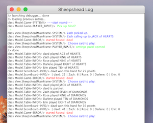

# Sheepshead

Sheepshead is a great card game-- a mixture of luck, skill, and family. I grew up playing this game and decided to implement a version of it in Java / Swing. At the moment, it is only a single player game (1 user with 4 AI), but plans are in the works to make it multiplayer. 

## Getting Started

Launch the jar file
```sh
java -jar out/artifacts/Sheepshead/Sheepshead.jar
```
*Note* - This project was configured using java 1.8.

The project should load and the app should appear after you enter your username :


If you haven't played sheepshead before, you might want to [check out the rules](https://en.wikipedia.org/wiki/Sheepshead_(game))-- it can be  a complicated game. To change settings (e.g. username, sound preference, gamespeed), click the top left settings panel :


You can also open up a logging tool by clicking the 'run debugger' option from settings :



Clicking on the top right will give you stats for the games you've played as well as the game score:


# Development

[Install IntelliJ](https://www.jetbrains.com/idea/download/) If you don't have it already. Then clone the project (`git clone https://github.com/dgoldstein1/Sheepshead.git`) and open up the directory with intelliJ. 

The source code is 100% java without any depencies, so no need for mvn. All you should have to do is click the green arrow to run the project, which launches the app's entrypoint, `SheepsheadRun.java`.

## Versioning

We use [SemVer](http://semver.org/) for versioning. For the versions available, see the [tags on this repository](https://github.com/your/project/tags). 

## Authors

* **David Goldstein** - [See More Work](https://david-goldstein.updog.co/#)

## License

This project is licensed under the MIT License - see the [LICENSE.md](LICENSE.md) file for details
